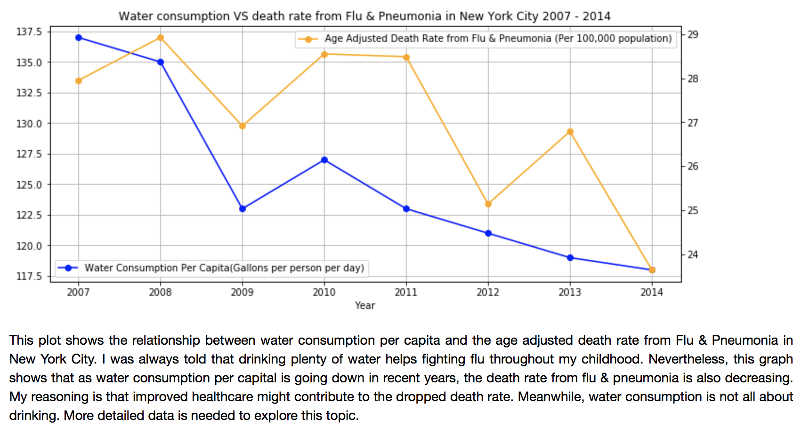

# Plot Review for yq729

This plot shows water consumption versus death rate from Flu and Pneumonia in New York City 2007-2014.

### CLARITY: 
When I first look at plot title, I think this plot shows the relationship between water consumption and death rate. When I look at this plot again, I realize that this plot actually shows the changes of water consumption and death rate from 2007 to 2014. 
Overall, this plot is easy to read. Two dependent variables have clear labels and units and discription of the plot can help reader easy to understand.

### ESTHETIC:
Colour chosing for two dependent variables are easy to distinguish. This plot is using line chart which is good to show the change.

### HONESTY:
I think the plot honestly reproducing the data.

### Improvement:
For this plot, shall we just plot the relationship between water consumption and death rate which means use them as dependent variable and independent variable without year, since it can show the relationship more strightforward. 
