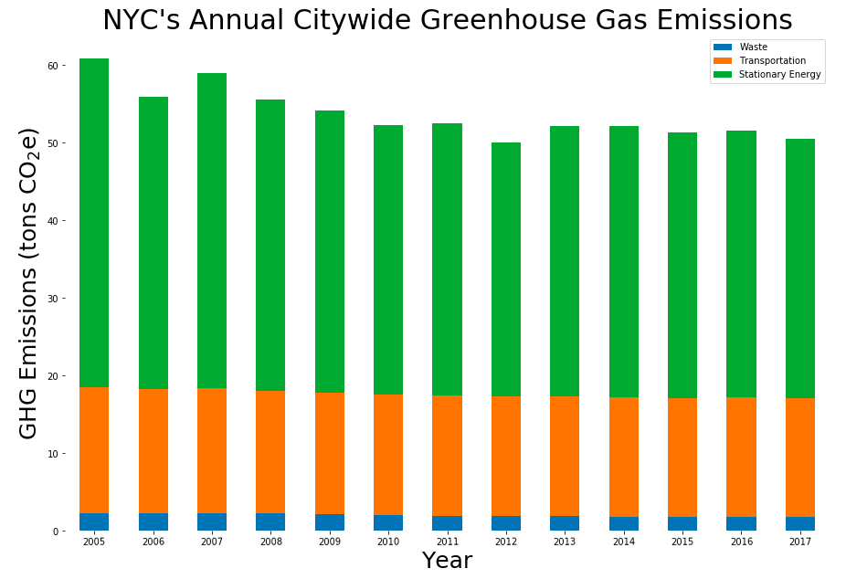

Clarity: The plot is easy to read with the title and labels clearly indicating what is being plot. Esthetic: The colors are chosen well to contradict each other. Honesty:The plot shows the trend clearly without misleading readers. Suggestion: can you explain why is the emission flat since 2016.
